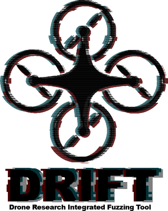
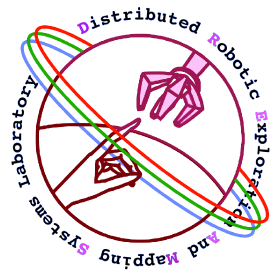

# Drone Research Integrated Fuzzing Tool



<div class="row">
    <div class="column">
        
    </div>
    <div class="column">
        
    </div>
    <div class="column">
        
    </div>
</div> 


The Drone Research Integrated Fuzzing Tool (DRIFT) Sponsored by the ASU DREAMS Lab. 

## Abstract 

It’s common knowledge that emerging technologies have played a central role in the modern world; one of these emerging technologies is autonomous drones and robotics. The introduction of automated robotics applications across the globe has spurred a need for secure systems. As more autonomous systems are introduced into high-risk jobs, we need a reusable and scalable method to make autonomous systems more secure and reliable. DRIFT is the implementation of both a GUI and CI approach to increasing security in automated robotics through Fuzzing, a recent development in systems security to improve automated bug discovery.  

## Getting Started   
There are two main ways to get started: with the [CI](#ci) or with the [GUI](#gui).
### GUI

The GUI will allow you to start a fuzzing instance, or multiple instances, from within the interface.
First you need to build the GUI, which will take a few minutes to build the docker image.

```bash
(cd src/drift-ui; ./build)
```

After building the GUI it can be started locally in the `src/drift-ui` folder. It's important that you put any binary target you want inside the `src/drift-ui` before runing:

```bash
(cd src/drift-ui; ./run)
```

Note that this run is based on your local directory, which must be `src/drift-ui`. You will now have GUI interface which will be running on `http://127.0.0.1:8080`. Simply paste that address into your web browser of choice and enjoy. 

### CI

The CI is a little more complicated to setup, but can be more effective than the GUI. Note, the current implementation of DRIFT allows you to view the fuzzer progress in the CI through a remotely connected GUI specified earlier. 


