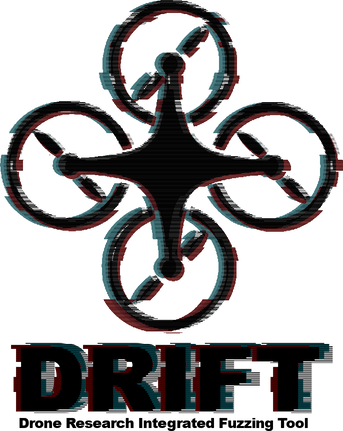

# Drone Research Integrated Fuzzing Tool

   


The Drone Research Integrated Fuzzing Tool (DRIFT) Sponsored by the [ASU DREAMS Lab](https://web.asu.edu/jdas/home). 

## Abstract 

It’s common knowledge that emerging technologies have played a central role in the modern world; one of these emerging technologies is [autonomous drones and robotics](https://www.ros.org/). The introduction of automated robotics applications across the globe has spurred a need for secure systems. As more autonomous systems are introduced into high-risk jobs, we need a reusable and scalable method to make autonomous systems more secure and reliable. 

DRIFT is the implementation of both a Guided User Interface (GUI) and a Continuous Integration (CI) approach to increasing security in automated robotics through [Fuzzing](https://searchsecurity.techtarget.com/definition/fuzz-testing), a recent development in systems security to improve automated bug discovery.  

## Getting Started   
`drift` requires:
* Python 3.7+. (Python 2 is not supported)
* Docker
* A *decent* system (At least 4 Core processor, 16 GB of ram **Dedicated**)
  * Minimum specs == Minimum Performance
  * Can be run in the cloud on AWS (t2.2xlarge versed well)

`drift` can be installed as a module using pip and the `requirements.txt` file in the repository. 

### Installed as a Module
`drift` can be installed via `pip`:
```console
pip install --requirement requirements.txt
```
It can then be run directly
```console
drift -h # Example running the help command
```
**Note:** Even as a module, it is recommended to run the program from within the downloaded code directory. Folders such as `resources` is essential to the operation of some of the program's operation. 
**Note:** It is recommended to use a python virtual environment to install modules and keep  our environment clean. If you wish to do so, you will need [pyenv](https://github.com/pyenv/pyenv) and the [pyenv-virtualenv plugin](https://github.com/pyenv/pyenv-virtualenv) before installing the module.

If you wish to have an easy install guide, follow the [install guide](#install_guide).

### Usage and Examples
```console
drift overwatch <regressionRepo>
drift cli <binary> <gitRepo> [--dictionary=DICT] [--args=ARGS] [--workdir=DIR] [--web] [--port=PORT]
drift web [-p | --port=PORT]
drift (-h | --help)

drift -h
drift cli chall.bin https://github.com/Pascal-0x90/Travis-Fuzz-Basic.git --web --port=80
drift overwatch git@github.com:Pascal-0x90/TestRepository.git
drift web -p 6969
```
#### Options
```console
-h --help                 Show this message.
--version                 Show the current version
--web                     Open a web server on PORT which shows
                        the current progress of the CLI.
--port=PORT               Define port number to host/attach.
                        to the WebGUI on. [default: 8888]
--dictionary=DICT         Define a path to a dictionary you
                        wish to use in the fuzzing proccess.
--args=ARGS               Define arguments to be sent to the
                        target being fuzzed. [default: @@]
--workdir=DIR             Define where the work directory
                        should be. [default: workdir]
```
#### Sample Output
```console
DEBUG    | Checking if current work directory exists
INFO     | Making build folder
DEBUG    | Forwarding port 8888
DEBUG    | 	Container Name: flamboyant_bhabha
		    ID: 8aa061300d76058a23a4c79573ef80f07c5fffe59ca7d94e8bfff69fe0559f64
		    Tag: pascal0x90/basic_phuzzer:latest
		    Ports: {}
		    Volumes: {'/DRIFT': {}, '/DRIFT/workdir': {}, '/root/.ssh': {}}
INFO     | Container initialized!
DEBUG    | Adjusting cores and scheduling
DEBUG    | Removing python2. Return to python3
DEBUG    | Clone project repository (from git{hub/lab})
INFO     | Successfully logged https://github.com/Pascal-0x90/Travis-Fuzz-Basic.git
None
DEBUG    | Compiling project..
INFO     | Successful compilation of chall.bin. Located in /DRIFT/build (hopefully)
None
INFO     | Begin fuzzing on /DRIFT/build/chall.bin
DEBUG    | Fixing perms so we can read directory.
None
DEBUG    | Web server started on port 8888
```

### WebUI
The GUI will allow you to start a fuzzing instance, or multiple instances, from within the interface.
Once you have the module installed, you can run the WebUI with the following command:

```console
drift web --port=8080
```

### Command Line Interface (CLI)
The CLI allows the user to run the whole fuzzing instance in a stand alone, easy to run, command line tool. It can be ran conveniently with:

```console
drift cli chall.bin https://github.com/Pascal-0x90/Travis-Fuzz-Basic.git 
```
Optionally, you can run the command line interface with a WebUI as well to see the current progress of the command line interface via a nice viewable web interface:
```console
drift cli chall.bin https://github.com/Pascal-0x90/Travis-Fuzz-Basic.git --web --port=80
```
### Continuous Integration (CI)
We can use the tool to begin CI interaction tool with a CI environment of your choice. Our team chose to use Travis CI to interact with our environment. The idea is as follows:
```
[Pipeline] -> [general pipeline]
            |
             \-> (Call to remote DRIFT Server) --> [Crashes sent to regression testing]
                  [DRIFT CI Server]
```
1. Pipeline in CI environment will kick off our remote DRIFT CI to start fuzzing.
2. The DRIFT fuzzing server has `overwatch` command running. This checks if the command from the CI environment has been sent to it. Once it does, we begin fuzzing.
3. When the DRIFT `overwatch` command finds a crash in the crash folder, it will then commit the newest crash to the given regression testing repo designated by the `overwatch` command ran.

A Web UI will be started on the remote fuzzing server and can be viewed on port `8888`. 

